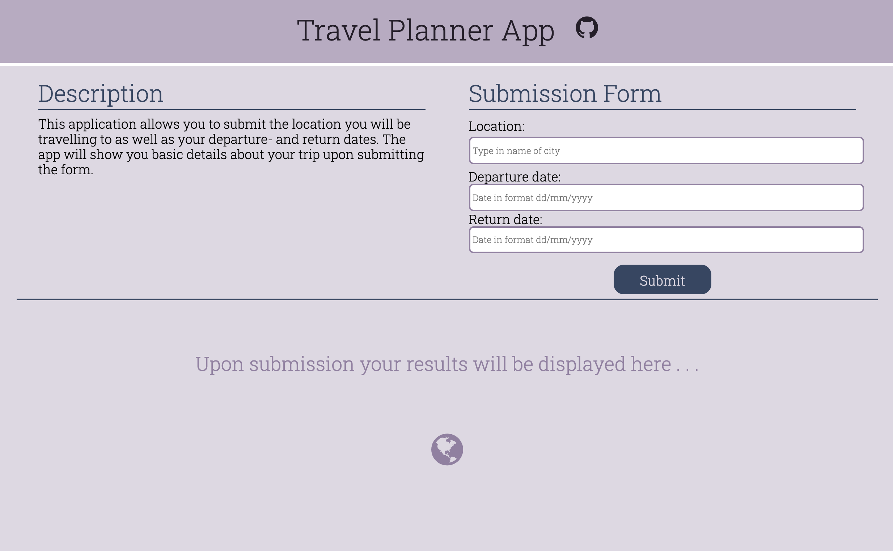

<!-- TABLE OF CONTENTS -->
## Table of Contents

* [About the Project](#about-the-project)
  * [Built With](#built-with)
* [Getting Started](#getting-started)
  * [Prerequisites](#prerequisites)
  * [Installation](#installation)
* [Contributing](#contributing)
* [License](#license)
* [Contact](#contact)

## Getting Started


<!-- ABOUT THE PROJECT -->
## About The Project

This project builds a single page website where the user can input a location as well as a departure- and return date for an upcomign journey. Upon submission the user will be displayed the length of the stay, a picture of the destination, as well as a weather forecast. Please note that if the departure date is within the next week the user will be displayed an exact weather forecast as serviced by the weatherbit API. If, however, the departure date is more than one week from today, the user will be displayed the past weather of that day and month one year ago. This is serves as a proxy for what a typical weather may be around the date of departure of the specific location.

The interface is displayed below.




### Built With
This project has been built using the following frameworks, plugins, and APIs.

#####Frameworks

* [Webpack](https://webpack.js.org)

#####Plugins / Dependencies

* [babel/core](https://babeljs.io/docs/en/babel-core)
* [babel/polyfill](https://babeljs.io/docs/en/babel-polyfill)
* [babel-preset-env](https://babeljs.io/docs/en/babel-preset-env)
* [babel-loader](https://www.npmjs.com/package/babel-loader/v/8.0.0-beta.1)
* [css-webpack-plugon](https://www.npmjs.com/package/clean-webpack-plugin)
* [css-loader](https://webpack.js.org/loaders/css-loader/)
* [file-loader](https://webpack.js.org/loaders/file-loader/)
* [html-webpack-plugin](https://webpack.js.org/plugins/html-webpack-plugin/)
* [jest](https://jestjs.io)
* [mini-css-extract-plugin](https://webpack.js.org/plugins/mini-css-extract-plugin/)
* [jest](https://jestjs.io)
* [node-sass](https://www.npmjs.com/package/node-sass)
* [optimize-css-assets-webpack-plugin](https://www.npmjs.com/package/optimize-css-assets-webpack-plugin)
* [sass-loader](https://webpack.js.org/loaders/sass-loader/)
* [style-loader](https://www.npmjs.com/package/style-loader)
* [terser-webpack-plugin](https://webpack.js.org/plugins/terser-webpack-plugin/)
* [webpack-dev-server](https://webpack.js.org/configuration/dev-server/)
* [workbox-webpack-plugin](https://www.npmjs.com/package/workbox-webpack-plugin)

#####APIs

* [Geonames](http://www.geonames.org)
* [Weatherbit](https://www.weatherbit.io)
* [Pixabay](https://pixabay.com)


<!-- GETTING STARTED -->
## Getting Started

This is an example of how you may give instructions on setting up your project locally.
To get a local copy up and running follow these simple example steps.

### Prerequisites

This is an example of how to list things you need to use the software and how to install them.
* npm
```sh
npm install npm@latest -g
```

### Installation


1. Clone the repo
```
git clone https://github.com/alex1ned/travel_planner.git
```
2. Install NPM packages
```
npm install
```
3. Get a free API credential from
	* [http://www.geonames.org](http://www.geonames.org)
	* [https://www.weatherbit.io](https://www.weatherbit.io)
	* [https://pixabay.com](https://pixabay.com)

4. In root folder create a new file called `.env`
5. In the file enter your credentials in the following way:
	* `GEONAMES_API_USERNAME=<your username>`
	* `WEATHERBIT_API_KEY=<your api key>`
	* `PIXABAY_API_KEY=<your api key>`
6. In the file `.gitignore` add the `.env` file name. This ensures that if you publish your project on github, that your api credentials will not be published on github and are not visible to anyone who may clone or view your project.


<!-- CONTRIBUTING -->
## Contributing

Any contributions you make are **greatly appreciated**.

1. Fork the Project
2. Create your Feature Branch (`git checkout -b feature/AmazingFeature`)
3. Commit your Changes (`git commit -m 'Add some AmazingFeature'`)
4. Push to the Branch (`git push origin feature/AmazingFeature`)
5. Open a Pull Request

Suggestions for possible **features to add** (w/o order of relevance):

* Add a clear button that resets the user interface.
* Add button that allows user to add another trip which will be displayed below the inital one.
* Allow user to add multiple destinations for the trip.

<!-- LICENSE -->
## License

No license.


<!-- CONTACT -->
## Contact

Alexander Nederegger - alexander@nederegger.de

Project Link: [https://github.com/alex1ned/travel_planner](https://github.com/alex1ned/travel_planner)

